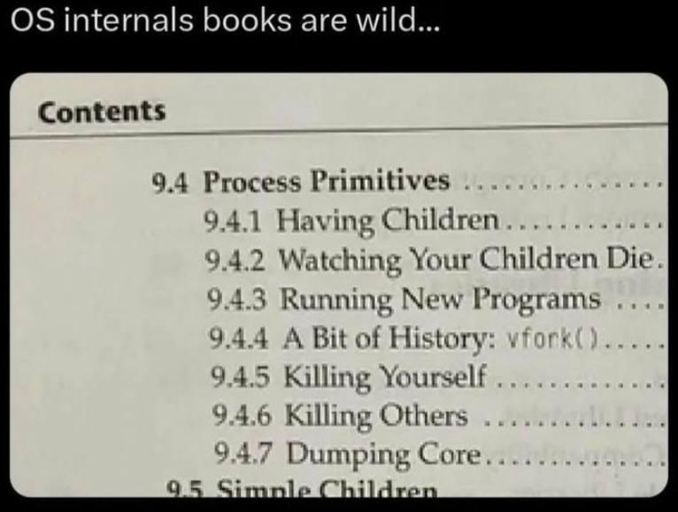

# 🧩 **What Is an Operating System Really Doing?**

  

<!-- presenter:
Start with an open-ended question: “When your code runs, who’s *really* in charge?”
Encourage them to think of the OS not as background noise but as an active, governing entity.
You can gesture to the image and say: "This diagram may look chaotic—but that’s precisely what the OS hides from us."
-->

---

## 💻 The Big Picture

> “The operating system is the bridge between human intention and machine execution.”

- It **manages resources** — CPU, memory, and I/O devices.
- It **abstracts hardware complexity** — providing interfaces instead of circuits.
- It **protects and isolates** — ensuring that one malfunctioning process doesn’t destabilize the entire system.

**Key idea:** The OS transforms _raw hardware_ into a _reliable computing environment_ where multiple programs can coexist and cooperate.

<!-- presenter:
Highlight that every action on a computer, from keypress to network packet, passes through the OS.
Mention that modern OS design isn’t just about efficiency—it’s about creating *trustworthy abstractions* so programmers can rely on consistent behavior across unpredictable hardware.
-->

---

## 🧠 A Conceptual Framing

Rather than thinking of the OS as a “middleman,” view it as an **executive management layer** in a complex organization.

- **CPU scheduling** → allocating executive attention to concurrent tasks.
- **Resource allocation** → distributing finite assets among competing departments.
- **Protection and isolation** → enforcing access control and preventing policy violations.
- **Coordination** → ensuring that independent units work toward shared goals.

The OS is the **governance model** of a computing system — establishing rules, priorities, and accountability.

<!-- presenter:
Use “executive management” to elevate the metaphor—less of a stage manager, more of a corporate operations model.
Draw parallels to human organizations: limited attention (CPU), budgets (memory), rules (access control).
Ask: “What happens to an organization without governance?” → chaos, inefficiency, and collapse. The OS prevents that at nanosecond scale.
-->

---

## ⚙️ Core Responsibilities

| Role                 | Description                                         | Comparable Domain                                |
| -------------------- | --------------------------------------------------- | ------------------------------------------------ |
| **Process Manager**  | Determines which programs execute and when          | Operations scheduling in manufacturing           |
| **Memory Manager**   | Allocates and tracks physical and virtual memory    | Urban planner assigning addresses and boundaries |
| **Device Manager**   | Controls access to I/O hardware                     | Air traffic controller managing shared runways   |
| **File Manager**     | Manages data persistence and retrieval              | Archivist maintaining a structured catalog       |
| **Security Manager** | Enforces authentication, permissions, and isolation | Compliance officer defining access policies      |

<!-- presenter:
You can walk through this table slowly, emphasizing how each role involves policy decisions and enforcement.
If time allows, ask: “Which of these roles has become *most complex* in the cloud era?”
(Usually Security and Resource Management—students might mention containerization, hypervisors, or virtual machines.)
-->

---

## 🧩 Resource Management

Computing resources — CPU cycles, memory blocks, disk bandwidth — are inherently **finite**.

The OS’s job is to manage scarcity efficiently and fairly.

- **CPU scheduling:** decides which process receives execution time.
- **Memory management:** allocates address space and prevents interference.
- **I/O coordination:** serializes device access to prevent contention.
- **File systems:** structure data for persistence, access, and consistency.

Each subsystem interacts under strict temporal and spatial constraints.  
The illusion of parallelism and infinite resources is an achievement of orchestration, not abundance.

<!-- presenter:
Emphasize that “illusion” — concurrency is one of the greatest design achievements of OS theory.
Draw a quick diagram on the board: CPU cores vs ready queue vs blocked queue.
Ask: “What kind of fairness model does the OS use?” — segue to scheduling policies (FCFS, RR, priority).
-->

---

## 🧠 Abstraction: Simplifying Interaction

Hardware operates at the level of **voltages, registers, and timing cycles**.  
Developers operate at the level of **files, processes, and APIs**.

The OS bridges this gap by constructing **abstractions** — conceptual models that hide hardware detail while exposing essential functionality.

Examples:

- `open("data.txt")` hides the complexity of locating disk blocks.
- `fork()` abstracts process creation and context duplication.
- Virtual memory abstracts physical RAM into a seamless, addressable space.

**Result:** Software engineers reason about _operations_ rather than _mechanisms_.

<!-- presenter:
Invite discussion: “Why are abstractions both powerful and dangerous?”
Guide toward: abstractions simplify development but can conceal performance costs (system calls, page faults, context switches).
If you want, mention that the OS itself is a stack of abstractions—from kernel modules down to device drivers.
-->

---

## 🔐 Protection and Isolation

In a multi-program environment, safety and predictability are paramount.

- Each process executes in an **isolated address space**.
- The OS mediates access to devices, files, and shared memory.
- Hardware support (e.g., privilege rings, page tables) enables enforcement.
- User mode vs. kernel mode defines the boundary between request and authority.

A modern system’s resilience depends on this discipline: a single rogue instruction must not compromise global integrity.

<!-- presenter:
Good place to reference Meltdown and Spectre as case studies in *broken isolation*.
Clarify: protection is policy, isolation is mechanism.
Ask: “What happens when policy is perfect but hardware leaks?” — this ties to real-world vulnerabilities.
-->

---

## 🧱 Why It Matters

Without an operating system:

- Each program would require its own drivers, schedulers, and memory protection.
- Concurrent execution would be unsafe or impossible.
- Resource conflicts would go unresolved.
- Human interaction would revert to raw binary communication.

The OS transforms a collection of components into a **computational ecosystem** — coordinated, efficient, and safe.

In essence, the OS is what converts _hardware capability_ into _computational civilization._

<!-- presenter:
Pause for effect at “computational civilization.”
Explain that the OS enables scalability, reliability, and delegation — the same properties we expect from functioning human societies.
Tie this back to the governance analogy — the OS defines law and order for electrons.
-->

---

## 🧩 Summary

| Function                   | Description                                            |
| -------------------------- | ------------------------------------------------------ |
| **Resource Management**    | Allocating and balancing finite hardware resources     |
| **Abstraction**            | Exposing simplified, stable interfaces for developers  |
| **Protection & Isolation** | Enforcing security and fault containment               |
| **Coordination**           | Integrating diverse subsystems into coherent operation |

<!-- presenter:
This slide is your recap.
Ask students to connect each function to a specific OS subsystem: “Where in Linux or Windows do you see this responsibility concretely implemented?”
Let them mention the scheduler, VMM, or file system daemon.
-->

---

## 🧩 Discussion Prompt

> “What architectural vulnerabilities emerge when process isolation is weak or absent?”

Possible threads:

- Race conditions and data corruption
- Escalation of privilege
- Denial of service
- Systemic instability

<!-- presenter:
Encourage them to give historical examples: Heartbleed (buffer over-read), or shared kernel memory exploits.
The key takeaway: isolation is foundational, not optional.
-->

---

## 🎯 Reflection

Complete this thought:

> “An operating system is like a **system of governance** because it **defines authority, responsibility, and cooperation**.”

Encourage concise but analytical responses — draw parallels to real-world systems (political, biological, organizational) that manage complexity through rules and hierarchy.

<!-- presenter:
Let them go abstract here — biological systems (homeostasis), governments (checks and balances), distributed orgs (hierarchy vs federation).
This helps them recontextualize OS design as a *model of controlled complexity*, not just code management.
-->

---

## 🧭 Next Topic

**Next ▶️** [Week 01 Topic 02: Processes and Threads](https://github.com/rugbyprof/5143-Operating-Systems/blob/master/Lectures/OS_Highlights/Week_01/002.pdf)

<!-- presenter:
Mention that in the next lecture, we’ll dive into “the unit of execution” — how the OS actually implements concurrency.
Remind them that understanding this first layer makes everything else in the course make sense.
-->

---

## 📚 References & Credits

> topic: "Operating Systems Week 1 Lecture Slides"  
> focus: "What is an OS really doing?"  
> format: "Markdown-based lecture slides"  
> author: "T. Griffin and OpenAI GPT-5"  
> credit: "Concept scaffolding with ChatGPT (OpenAI GPT-5)"

<!-- presenter:
Close by giving credit to the collaborative nature of material development — that even AI-assisted drafting benefits from human curation.
Encourage them to think of OS design as the same: human-guided automation.
-->
